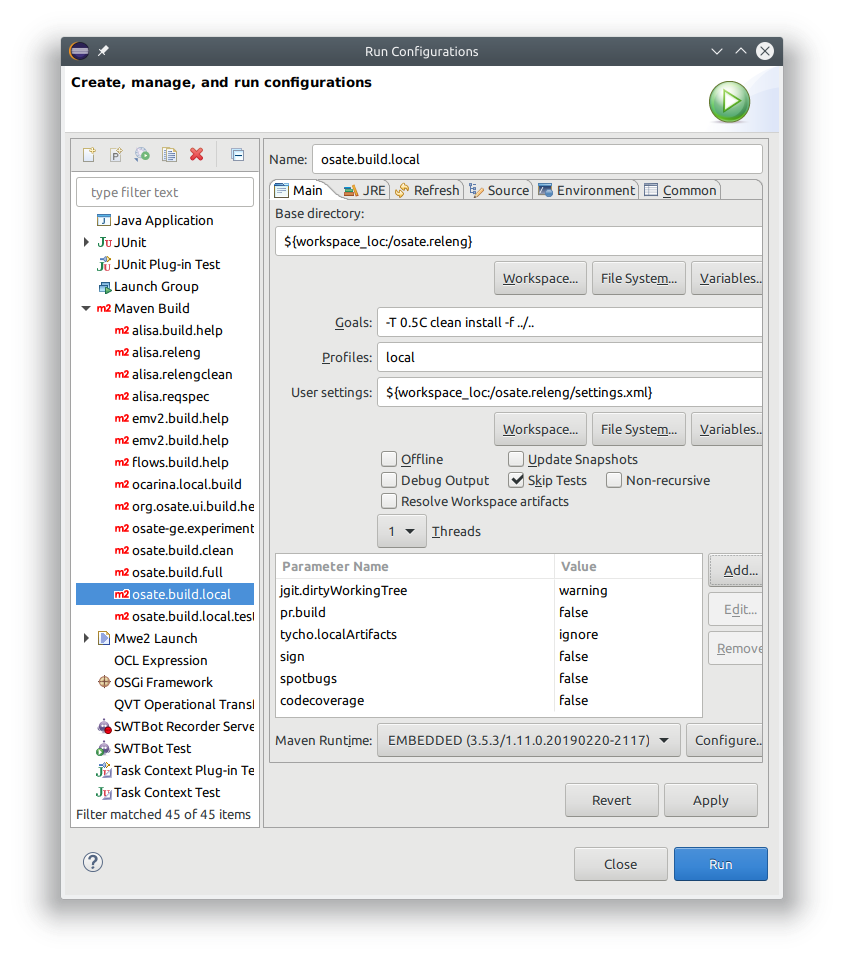

# Building OSATE

OSATE is built using maven with the tycho plugin. Maven can be run inside Eclipse or from the command line.

To run the build inside Eclipse we provide a couple of launch configurations in project osate.releng. The launch configurations can be run from Eclipse's `Run Configurations...` dialog. They are inserted under the Maven Build category.

The available launch configurations are

 * **osate.build.local** - build OSATE for the local operating system, e.g., build the windows version on a windows machine.
 * **osate.build.local.tests** - same as osate.build.local but also run all available tests
 * **osate.build.full** - build for all platforms, run all tests
 
The build can be configured by modifying the launch configuration. 

Available profiles *local* and *full* determine if the build is for the local operating system only or for all operating systems.

Used parameters are

 * **tycho.dirtyWorkingTree** - Issue a *warning* or an *error* if there are files that uncommitted source files in the build.
 * **pr.build** - *true* build a pull request (no product archive created), *false* build the product(s)
 * **tycho.localArtifacts** - *ignore* only use artifacts from the current build and specified repositories to resolve dependencies.
 * **sign** - *true* perform jar signing during the build, *false* don't sign jars
 * **spotbugs** - *true* run spotbugs during the build, *false* don't run spotbugs
 * **codecoverage** - *true* run jacoco to create a code coverage report, *false* don't run jacoco
 
 