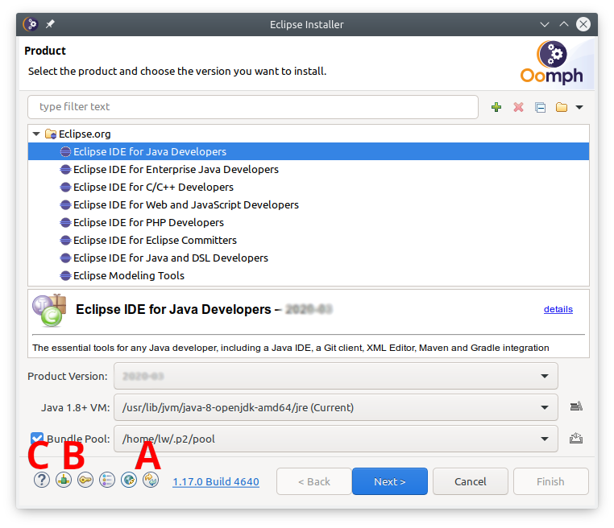

# Setting up an OSATE development environment 

Starting with OSATE 2.3, which is based on Eclipse 4.7.1 (Oxygen.1), the recommended way to set up a development environment uses the Eclipse Installer.

<small>**Note:** Java SDK 1.8 is recommended to compile OSATE sources.</small>

## 1. Download the installer

The Eclipse Installer can be downloaded from the eclipse Web site. Follow this [link](https://www.eclipse.org/downloads/) to download the installer for your platform. 

On Mac OSX and Linux the installer is a compressed archive. Extract it to a directory of your choice.

The installer for Windows is a self-extracting archive. When running the executable you can choose to keep the extracted installer and select an installation directory. 

<small>**Note:** On Windows the initial extraction is into a temporary directory, usually into a temporary directory in C:\User\Joe\AppData\Local\Temp\. The name of the temporary directory starts with the letters *eoi*. If your computer is subject to a restrictive security policy that does not allow execution of arbitrary programs from that directory you should copy the directory content to another place from where the installer can be executed.</small>

## 2. Run the installer

Open the menu (A), bundle pools should be on (B), and switch to advanced mode (C)

## 3. Select the Eclipse platform

On first use update the installer (A)

If necessary, configure proxy settings, and optionally enter ssh credentials (B). User the help (C) for more detailed information on these steps.

Select *Eclipse Modeling Tools* as the base product to install, and select *2019-03* as the product version. Choose 64bit as your Java version.

## 4. Add the OSATE setup file

Add a user project by clicking on the + icon (A).

Select the catalog *Github Projects* and enter the following URL as the *Resource URI*:

https://raw.githubusercontent.com/osate/osate2/master/setup/osate2_2019-03.setup

Check the box next to the added OSATE2 Development entry in the tree under Github Projects/<User>. Then select the master stream in right column of the table at the bottom.

## 5. Set required variables

Check *Show all variables* near the bottom of the dialog. Without this, only variables that do not have a value will be displayed. Oomph stores variable values between invocations, so nothing would be shown after the first run.

The first group of variables determines the directory for the new eclipse installation. You can choose between (a) a root directory and a subdirectory within that root directory and (b) a full path to the installation directory.

The next group determines the location of the workspace. Do not reuse an existing workspace as that will likely lead to problems.

The git clone location is the root directory into which all git repositories are cloned. The tycho build requires that all git repositories share the same root directory. If you have (all or some) repositories cloned already you can re-use the clones. Make sure that all clones have the develop branch checked out (except osate2-ocarina, which has just a master branch). Also, make sure that they are up to date by issuing a _git pull_ command.

Finally, choose how to access the git repositories. The default choice uses ssh access and requires ssh credentials (click the key icon at the bottom to set this up), and your public key must be uploaded to github. The  *HTTPS (read-write)* option uses your Github username and password. When you choose https a variable for the user name will show up. Replace the default _anonymous_ with your github user name. 

## 6. Install Eclipse

The next screen shows the installation steps that will be executed. Click *Finish* to download eclipse and install it to the selected location. When run for the first time, it will download features and plugins into the bundle pool. The bundle pool is shared among eclipse installations such that subsequent installations are much faster.

## 7. Get OSATE sources

Upon first start eclipse executes additional setup tasks to set preferences, clone git repositories if needed, import projects, and organize projects into working sets.

The OSATE2 setup file sets the following preferences:

* The Java perspective is set as the default and eclipse is configured to start with this perspective.
* The default file encoding is set to UTF-8.
* A source cleanup profile *Osate* is created and enabled for the workspace.
* Java formatter profiles *Osate* and *SMACCM*. Profile *Osate* is enabled for the workspace.
* Java code cleanup on save are configured and enabled for the workspace.
* An Xtend formatter profile *Osate* is created and enabled for the workspace.

Cloning the git repositories takes some time. Progress can be viewed in a dialog. To show the progress dialog, click on the animated icon the eclipse status bar.

## 8. Updating the development environment

Ideally the development environment is completely managed using the setup file. This implies that additional plugins or git repositories should not be added manually. Instead, the setup file should be updated. All developers can then update the eclipse installation by re-executing the setup process. This happens every time eclipse is started (unless disabled in the preferences) or can be done manually via *Help* -> *Perform Setup Tasks ...*

Please report issues with the setup using the osate2 issue tracker on Github.

## Q & A / Troubleshooting

### The heap size is set to 1GB. How do I increase that to 2GB?

The initial heap size is set to 1GB for 32bit environments with a process size limitation of 2GB, in particular 32-bit Windows.
You *will* want to increase the heap size to a minimum of 2GB due to the Xtend environment.
You can edit the user setup to override the setting for all eclipse installations. Follow these steps in Eclipse:

1. Open the user setup: _Navigate_ -> _Open Setup_ -> _User_
2. Add an Eclipse Ini task: In the setup editor right click on *User* and select *New Child* -> *Eclipse Ini*
3. Edit the task properties: Right click on the new *Eclipse Ini* task and select *Show Properties View*
4. Set the maximum heap size value: In the *Properties* view
    1. Set _Option_ to "-Xmx" (without the quotes)
    2. Set _Value_ "2g" or "2048m" (without the quotes) to set the heap size to 2GB
    3. Set  _VM_ to "true".
    
   

5. Save the user setup
6. Execute the setup: *Help* -> *Perform Setup Tasks...*

You can also edit the installation setup to establish a maximum heap size just for this eclipse installation.

### Can I add the OSATE2 project setup to that an existing workspace?

Yes, a project setup can be imported into a workspace: _File_ -> _Import..._ -> _Oomph_ -> _Projects into workspace_ 

You can also use the import to add additional project setups to a workspace.
  
### I want to use the eclipse installation with a new workspace?

No problem. Switch to the new workspace location and import the OSATE2 project setup.

Alternatively, you can create a new eclipse installation for each new workspace workspace. When using a bundle pool, an eclipse installation is comparatively lightweight, and quick to set up.
  
### How do I add a feature to my eclipse installation and share it with others in my team?

Create your own setup file and import it into eclipse. P2 Director tasks install features in eclipse. It is recommended to put setup files under version control.

### I have installed a feature in my eclipse installation, but it's not available when I start OSATE using a launch configuration.

Installed features must be part of the target platform to be available to a runtime workbench. The OSATE2 setup uses a target platform _Modular Target_. To add to this target create a _Targlet_ in your setup. See osate2.setup for an example.

### How can I add a feature to the OSATE2 development setup?

Edit the OSATE2 setup (add a P2 director task and/or a targlet) and submit a pull request. **DO NOT push a modified _osate2.setup_ file to the develop branch on github!**

### I get an error message "Target is not a JDK Root. Java executable was not found"

This tends to happen on Windows when the Java version is updated. Oracle's installer removes the old version and installs the new version into a new directory. Go back in the Oomph dialog to the variables page and change the *JRE 1.8 Location* variable to the new location.

### Where can I find documentation about Oomph setups?

On the eclipse wiki: [Eclipse Oomph Authoring](https://wiki.eclipse.org/Eclipse_Oomph_Authoring)
