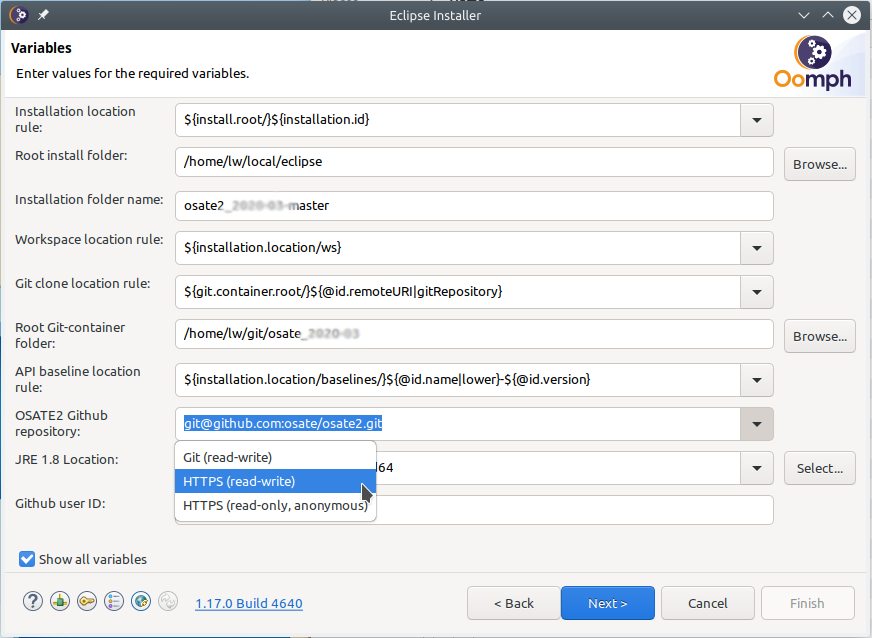

Setting up an OSATE development environment
===========================================

The recommended way to set up a development environment uses the Eclipse
Installer.

\ **Note:** It is no longer necessary to install Java separately.

1. Download the installer
-------------------------

The Eclipse Installer can be downloaded from the Eclipse Web site.
Follow this
`link <https://www.eclipse.org/downloads/packages/installer>`__ to
download the installer for your platform.

On macOS and Linux the installer is a compressed archive. Extract it to
a directory of your choice.

The installer for Windows is a self-extracting archive. When running the
executable you can choose to keep the extracted installer and select an
installation directory.

\ **Note:** On Windows the initial extraction is into a temporary
directory. If your computer is subject to a restrictive security policy
that does not allow execution of arbitrary programs from that directory
you can download the windows installer as a zip file from
`here <https://download.eclipse.org/oomph/products/eclipse-inst-jre-win64.zip>`__
and extract it to a directory that allows program execution.

2. Run the installer
--------------------

.. figure:: images/installer1.png
   :alt: Installer 1

   Installer 1

Open the menu (A), bundle pools should be on (B), and switch to advanced
mode (C)

3. Select the Eclipse platform
------------------------------

.. figure:: images/installer2.png
   :alt: Installer 2

   Installer 2

On first use update the installer (A)

If necessary, configure proxy settings, and optionally enter ssh
credentials (B). Use the help (C) for more detailed information on these
steps.

Select **Eclipse IDE for Java Developers** as the base product to
install, and select **2021-03** as the product version. **DO NOT USE
Latest Release (2021-03).**

Select the **JRE 11.0.2 …** entry as the Java 11+ VM.

4. Add the OSATE setup file
---------------------------

.. figure:: images/installer3.png
   :alt: Installer 3

   Installer 3

Add a user project by clicking on the + icon (A).

Select the catalog *Github Projects* and enter the following URL as the
*Resource URI*:

**https://raw.githubusercontent.com/osate/osate2/master/setup/osate2_2021-03.setup**

Check the box next to the added OSATE2 Development entry in the tree
under Github Projects/.

5. Set required variables
-------------------------

   Installer 4

Check *Show all variables* near the bottom of the dialog. Without this,
only variables that do not have a value will be displayed. Oomph stores
variable values between invocations, so nothing would be shown after the
first run.

The first group of variables determines the directory for the new
Eclipse installation. In *Installation location rule* you can choose
between (a) a root directory and a subdirectory within that root
directory and (b) a full path to the installation directory. Depending
on your choice you will need to fill in the installation path and
directory name.

The next group determines the location of the workspace. Do not reuse an
existing workspace as that will likely lead to problems.

The *Git clone location rule* determines how the path to the osate2 git
repository clone is constructed. The osate2 git repository can be cloned
in a directory in the installation location, workspace location, or
elsewhere. Depending on the location a new field will be shown to enter
a directory.

The *API baseline location rule* determines how the path to store API
baseline files is constructed. The API baseline(s) can be stored in a
directory in the installation location, workspace location, or
elsewhere. Depending on the location a new field will be shown to enter
a directory. *Do not store API baseline files in a local git
repository.*

Finally, choose how to access the git repositories. The default choice
uses ssh access and requires ssh credentials (click the key icon at the
bottom to set this up), and your public key must be uploaded to GitHub.
The *HTTPS (read-write)* option uses your GitHub username and password.
When you choose https, a variable for the user name will show up.
Replace the default *anonymous* with your GitHub user name.

6. Install Eclipse
------------------

The next screen shows the installation steps that will be executed.
Click *Finish* to download Eclipse and install it to the selected
location. When run for the first time, it will download features and
plugins into the bundle pool. The bundle pool is shared among Eclipse
installations such that subsequent installations are much faster.

7. Get OSATE sources
--------------------

Upon first start Eclipse executes additional setup tasks to set
preferences, clone git repositories if needed, import projects, and
organize projects into working sets.

The OSATE2 setup file sets the following preferences:

-  The Java perspective is set as the default and Eclipse is configured
   to start with this perspective.
-  The default file encoding is set to UTF-8.
-  A source cleanup profile *Osate* is created and enabled for the
   workspace.
-  Java formatter profiles *Osate* is created and enabled for the
   workspace.
-  Java code cleanup actions on save are configured and enabled for the
   workspace.
-  An Xtend formatter profile *Osate* is created and enabled for the
   workspace.

Cloning the git repositories takes some time. Progress can be viewed in
a dialog. To show the progress dialog, click on the animated icon the
Eclipse status bar.

8. Install the JavaFX SDK
-------------------------

The JavaFX must be installed manually.

-  Download the SDK for your development platform from the `JavaFX
   website <https://openjfx.io/>`__. For example: “JavaFX Windows SDK”.
-  Extract the SDK to your preferred path.
-  Configure the development enivornment with the path to the SDK.

   -  Open Eclipse preferences: *Windows -> Preferences*
   -  Select *JavaFX*
   -  Set *JavaFX 11+ SDK* to the *lib* folder of the SDK.

9. Updating the development environment
---------------------------------------

Ideally the development environment is completely managed using the
setup file. This implies that additional plugins or git repositories
should not be added manually. Instead, the setup file should be updated.
All developers can then update the Eclipse installation by re-executing
the setup process. This happens every time Eclipse is started (unless
disabled in the preferences) or can be done manually via *Help* ->
*Perform Setup Tasks …*

Please report issues with the setup using the osate2 issue tracker on
GitHub.

Q & A / Troubleshooting
-----------------------

The heap size is set to 4GB. How do I change that to 2GB?
~~~~~~~~~~~~~~~~~~~~~~~~~~~~~~~~~~~~~~~~~~~~~~~~~~~~~~~~~

You can edit the user setup to override the setting for all Eclipse
installations. Follow these steps in Eclipse:

1. Open the user setup: *Navigate* -> *Open Setup* -> *User*

2. Add an Eclipse Ini task: In the setup editor right click on *User*
   and select *New Child* -> *Eclipse Ini*

3. Edit the task properties: Right click on the new *Eclipse Ini* task
   and select *Show Properties View*

4. Set the maximum heap size value: In the *Properties* view

   1. Set *Option* to “-Xmx” (without the quotes)
   2. Set *Value* “2g” or “2048m” (without the quotes) to set the heap
      size to 2GB
   3. Set *VM* to “true”.

   .. figure:: images/heapsize.png
      :alt: Properties View

      Properties View Screenshot

5. Save the user setup

6. Execute the setup: *Help* -> *Perform Setup Tasks…*

You can also edit the installation setup to establish a maximum heap
size just for this Eclipse installation.

Can I add the OSATE2 project setup to an existing workspace?
~~~~~~~~~~~~~~~~~~~~~~~~~~~~~~~~~~~~~~~~~~~~~~~~~~~~~~~~~~~~

Yes, a project setup can be imported into a workspace: *File* ->
*Import…* -> *Oomph* -> *Projects into workspace*

You can also use the import to add additional project setups to a
workspace.

I want to use the Eclipse installation with a new workspace. Can I do that?
~~~~~~~~~~~~~~~~~~~~~~~~~~~~~~~~~~~~~~~~~~~~~~~~~~~~~~~~~~~~~~~~~~~~~~~~~~~

No problem. Switch to the new workspace location and import the OSATE2
project setup.

Alternatively, you can create a new Eclipse installation for each new
workspace. When using a bundle pool, an Eclipse installation is
comparatively lightweight, and quick to set up.

How do I add a feature to my Eclipse installation and share it with others in my team?
~~~~~~~~~~~~~~~~~~~~~~~~~~~~~~~~~~~~~~~~~~~~~~~~~~~~~~~~~~~~~~~~~~~~~~~~~~~~~~~~~~~~~~

Create your own setup file and import it into Eclipse. P2 Director tasks
install features in Eclipse. It is recommended to put setup files under
version control.

I have installed a feature in my Eclipse installation, but it’s not available when I start OSATE using a launch configuration.
~~~~~~~~~~~~~~~~~~~~~~~~~~~~~~~~~~~~~~~~~~~~~~~~~~~~~~~~~~~~~~~~~~~~~~~~~~~~~~~~~~~~~~~~~~~~~~~~~~~~~~~~~~~~~~~~~~~~~~~~~~~~~~

Installed features must be part of the target platform to be available
to a runtime workbench. The OSATE2 setup uses a target platform *Modular
Target*. To add to this target create a *Targlet* in your setup. See
osate2.setup for an example.

How can I add a feature to the OSATE2 development setup?
~~~~~~~~~~~~~~~~~~~~~~~~~~~~~~~~~~~~~~~~~~~~~~~~~~~~~~~~

Edit the OSATE2 setup (add a P2 director task and/or a targlet) and
submit a pull request. **DO NOT push a modified osate2.setup file to the
develop branch on GitHub!**

How can I prevent NoClassDefFoundError exceptions from being thrown when opening the graphical editor?
~~~~~~~~~~~~~~~~~~~~~~~~~~~~~~~~~~~~~~~~~~~~~~~~~~~~~~~~~~~~~~~~~~~~~~~~~~~~~~~~~~~~~~~~~~~~~~~~~~~~~~

Add “-Dosgi.framework.extensions=org.eclipse.fx.osgi” (without the
quotes) to the VM arguments of your launch configuration.

Where can I find documentation about Oomph setups?
~~~~~~~~~~~~~~~~~~~~~~~~~~~~~~~~~~~~~~~~~~~~~~~~~~

On the Eclipse wiki: `Eclipse Oomph
Authoring <https://wiki.eclipse.org/Eclipse_Oomph_Authoring>`__

There are too many steps, is there a faster way?
~~~~~~~~~~~~~~~~~~~~~~~~~~~~~~~~~~~~~~~~~~~~~~~~

If you have already installed the Eclipse Installer on your computer try
`this
link <eclipse+installer:https://raw.githubusercontent.com/osate/osate2/master/setup/OSATEConfiguration.setup>`__.
